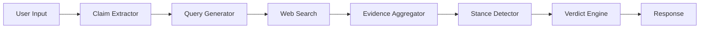

# 🔍 VeriFact

**AI-Powered Fact-Checking System using NLP and Machine Learning**

[](https://github.com/AdetyaJamwal04/Fake_News_Detection/actions/workflows/deploy.yml)
[](https://opensource.org/licenses/MIT)
[](https://www.python.org/downloads/)

## Overview

A production-ready fact-checking API that verifies claims by:
1. **Extracting claims** from text or URLs
2. **Searching the web** for evidence (Tavily, DuckDuckGo)
3. **Analyzing stance** using NLI models (BART-MNLI)
4. **Computing verdicts** with weighted credibility scoring

## 🏗️ Architecture



### Core Modules

| Module | Description |
|--------|-------------|
| `claim_extractor` | Extracts claims from text/URLs using NLP |
| `query_generator` | Generates search queries using KeyBERT |
| `web_search` | Multi-API search (Tavily + DuckDuckGo fallback) |
| `scraper` | Fetches and cleans article content |
| `embedder` | Sentence embeddings using SBERT |
| `stance_detector` | NLI-based stance classification |
| `source_scorer` | Credibility weighting for sources |
| `evidence_aggregator` | Combines and ranks evidence |
| `verdict_engine` | Final verdict with confidence scores |

## 🚀 Quick Start

### Using Docker (Recommended)

```bash
docker pull adetyajamwal/fake-news-detector:latest
docker run -d -p 5000:5000 --name fake-news-detector \
  -e TAVILY_API_KEY=your_key \
  adetyajamwal/fake-news-detector:latest
```

### Local Development

```bash
# Clone and install
git clone https://github.com/AdetyaJamwal04/Fake_News_Detection.git
cd Fake_News_Detection
pip install -r requirements.txt

# Run
python app_flask.py
```

## 📡 API Reference

### Check a Claim

```bash
POST /api/check
Content-Type: application/json

{
  "claim": "The Earth is flat",
  "max_results": 3
}
```

**Response:**
```json
{
  "verdict": "LIKELY FALSE",
  "confidence": 0.92,
  "net_score": -1.45,
  "evidences": [...],
  "explanation": {...}
}
```

### Endpoints

| Endpoint | Method | Description |
|----------|--------|-------------|
| `/` | GET | Web UI |
| `/api/health` | GET | Health check with metrics |
| `/api/check` | POST | Fact-check a claim |

## ⚙️ Configuration

| Variable | Description | Default |
|----------|-------------|---------|
| `TAVILY_API_KEY` | Tavily search API key | - |
| `PORT` | Server port | 5000 |
| `DEBUG` | Debug mode | false |

## 🧪 Testing

```bash
pytest tests/ -v
```

## 🛠️ Tech Stack

- **Backend:** Flask, Gunicorn, WhiteNoise
- **ML/NLP:** Sentence-Transformers (SBERT), HuggingFace Transformers
- **Models:** BART-MNLI (stance), all-MiniLM-L6-v2 (embeddings)
- **Search:** Tavily API, DuckDuckGo
- **Deployment:** Docker, GitHub Actions, AWS EC2

## 📄 License

MIT License - see [LICENSE](LICENSE) for details.

## 👤 Author

**Adetya Jamwal**
- GitHub: [@AdetyaJamwal04](https://github.com/AdetyaJamwal04)
